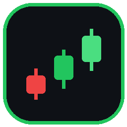
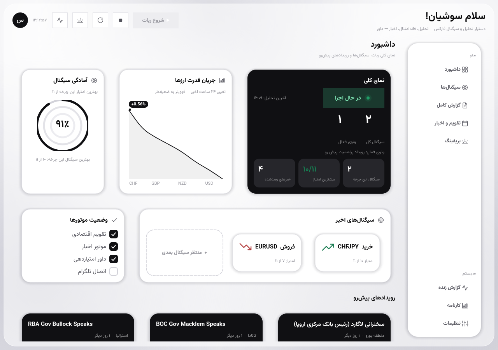
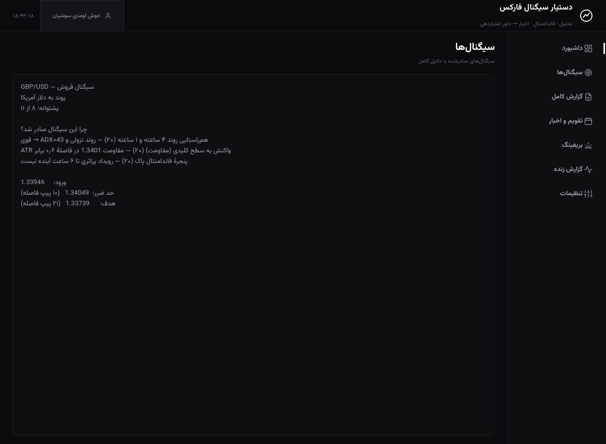
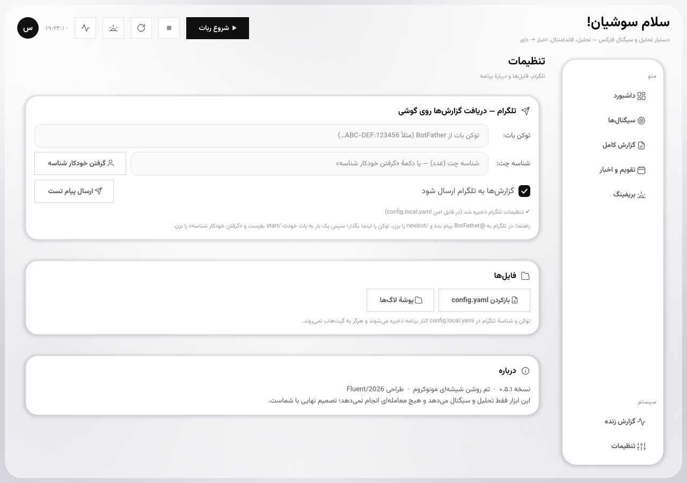
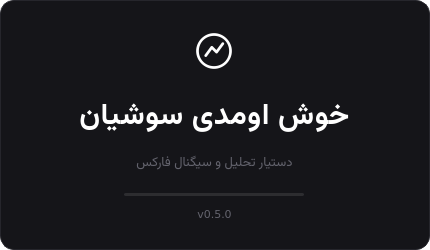

<div align="center">



# 🛡️ ODIN Assistant

### دستیار تحلیل و سیگنال فارکس — به فارسی، صادقانه، بدون معاملهٔ خودکار

بازار را از چهار سو می‌سنجد (تکنیکال · فاندامنتال · اخبار · تریدینگ‌ویو)،
به هر فرصت **امتیاز پشتوانه** می‌دهد و فقط سیگنالِ دارای پشتوانه را
با **دلایل کامل فارسی** روی تلگرامت می‌فرستد.

[](https://github.com/KhodeSushianm/Trading-Bot/releases/latest)
[](https://github.com/KhodeSushianm/Trading-Bot/actions)
[](https://github.com/KhodeSushianm/Trading-Bot/releases/latest)
[](https://github.com/KhodeSushianm/Trading-Bot/releases/tag/v0.21.0)
[](requirements.txt)
[](#-چرا-odin)

</div>

> ### 🔀 تغییر مسیر پروژه (v0.22.0)
> **تمرکز توسعه از v0.22.0 فقط روی نسخهٔ اندروید است.** نسخهٔ ویندوز در
> `v0.21.0` **منجمد** شد: کدش در ریپو باقی است و کار می‌کند، ولی دیگر بیلد،
> ریلیز یا قابلیت تازه نمی‌گیرد. آخرین نسخهٔ ویندوز:
> [v0.21.0](https://github.com/KhodeSushianm/Trading-Bot/releases/tag/v0.21.0).
>
> ⚠️ موتور پایتون **حذف نشد**، چون سه نقش حیاتی برای خودِ اپ اندروید دارد:
> اوراکلِ ۲۴ تست برابری موتور JS · منبع حقیقتِ ۴۱ توکن رنگ · منبع
> `versionName`/`versionCode`. جزئیات در [`CHANGELOG.md`](CHANGELOG.md).

<div align="center">



<sub>📸 تصویر بالا از <b>نسخهٔ ویندوز (منجمد در v0.21.0)</b> است — تنها اسکرین‌شات‌های
موجود. زبان بصری «Aurora Glass 2.0» از v0.21.0 در اپ اندروید هم پیاده شده
(همان ۴۱ توکن رنگ، همان اجزا) و از v0.23.0 <b>صفحهٔ ورود جوهری</b> هم دارد،
ولی <b>اسکرین‌شات اندروید هنوز گرفته نشده</b> چون به گوشی/شبیه‌ساز واقعی نیاز
دارد. تا آن زمان این تصویر را نمونهٔ زبان بصری ببینید، نه نمای دقیق اپ اندروید.</sub>

</div>

---

## ✨ چرا ODIN؟

| | |
|:---:|---|
| 📱 | **اپ اندروید ۷.۰+ با رصد پس‌زمینه** — سیگنال بدون باز کردن اپ، هشدار قیمت، نمودار کندل، اشتراک کارت تصویری. APK فقط ~۰٫۴MB و بدون هیچ وابستگی بیرونی (بدون AndroidX) |
| 🎨 | **Aurora Glass 2.0** — پس‌زمینهٔ شفق متحرک، کارت کنسول تیره، کارت سیگنال ساختاریافته، کارت‌های KPI؛ مونوکروم به‌جز سبزِ خرید، قرمزِ فروش/وتو و کهرباییِ رتبه |
| 🖥️ | ~~نصب‌کنندهٔ رسمی ویندوز~~ — **منجمد در v0.21.0** (setup.exe + نسخهٔ پرتابل؛ هنوز قابل دانلود و استفاده) |
| 📱 | **اندروید ۷.۰+ با رصد پس‌زمینه** — همان مغز، در جیب؛ سیگنال بدون باز کردن اپ، هشدار قیمت، نمودار کندل، اشتراک کارت تصویری |
| ⚖️ | **داور امتیازدهی** — سیگنال فقط با ≥۷ از ۱۱ امتیاز و عبور از ۷ دروازهٔ وتو؛ وگرنه دلیل رد شدن مکتوب می‌شود |
| 🪞 | **حلقهٔ صداقت** — هر سیگنال در ژورنال ثبت و نتیجه‌اش **خودکار** از کندل‌ها پیگیری می‌شود؛ کارنامهٔ هفتگی نرخ برد و میانگین R را بدون روتوش نشان می‌دهد |
| ⚙️ | **تنظیمات زندهٔ کامل** — نام نمایشی، داور و آستانه‌ها، شش دروازهٔ وتو، موتورها، فاصلهٔ حلقه، ژورنال/بریفینگ و ظاهر؛ همه با سوئیچ/قدم‌شمار و **ذخیرهٔ فوری** (آینهٔ صفحهٔ تنظیمات نسخهٔ اندروید) |
| 📱 | **تلگرام** — بریفینگ صبحگاهی 🌅، سیگنال زنده 🎯، هشدار رویداد 🚨، خلاصهٔ شبانه 🌙 |
| 💰 | **هزینهٔ صفر** — دادهٔ رایگان بدون کلید API، بدون سرور، بدون وابستگی به متاتریدر |

> ⚠️ ODIN هیچ معامله‌ای را خودکار اجرا نمی‌کند. او تحلیل می‌کند، دلیل می‌آورد، پیشنهاد می‌دهد —
> و تصمیم نهایی همیشه مال توست.

---

## 🖼️ نگاهی به رابط کاربری

> 🖥️ **همهٔ تصویرهای زیر از نسخهٔ ویندوز (منجمد در v0.21.0) هستند.**
> اپ اندروید این صفحه‌ها را دارد: خانه · سیگنال‌ها · تقویم · اخبار · ژورنال ·
> تنظیمات · بریفینگ · دربارهٔ ما · نمودار — به‌علاوهٔ **صفحهٔ ورود جوهری**
> (v0.23.0، پورت `onboarding.py` دسکتاپ). زبان بصری دو پلتفرم یکی است و این
> ادعا با `smoke_theme_parity.js` (۲۱۱ بررسی) قفل شده؛ ولی اسکرین‌شات اندروید
> هنوز گرفته نشده و تصویر ویندوزی جایگزینش نمی‌شود.

| داشبورد | سیگنال‌ها |
|:---:|:---:|
|  |  |
| **تنظیمات** | **خوش‌آمدگویی** |
|  |  |

---

## 🎯 یک سیگنال واقعیِ ODIN چنین است

```text
══════════════════════════════════════════════════════════════
🟢 سیگنال خرید — CHF/JPY
فرانک سوئیس / ین ژاپن
⭐⭐⭐⭐⭐ پشتوانه: ۱۰ از ۱۱
🕒 سشن: لندن/نیویورک

چرا این سیگنال صادر شد؟
✅ هم‌راستایی روند ۴ ساعته و ۱ ساعته (+۲) — روند صعودی؛ ADX=28 → روند قوی
✅ واکنش به سطح کلیدی (حمایت) (+۲) — سایهٔ کندل H4 حمایت 180.90 را لمس کرد
✅ پنجرهٔ فاندامنتال پاک (+۲) — هیچ رویداد مهم CHF/JPY در ۶ ساعت آینده
✅ تایید مومنتوم (RSI) (+۱) — RSI(H1)=42 در منطقهٔ پولبک و رو به بالا
...
مدارکی که امتیاز نگرفتند (صادقانه):
➖ تایید خبری (۰ از ۱) — خبر هم‌جهت پیدا نشد (وتو هم نکرد)

📍 ورود: 181.420   🛑 حد ضرر: 180.980 (۴۴ پیپ)   🎯 هدف: 182.520 (۱۱۰ پیپ)
⚖️ نسبت سود به ریسک: ۱:۲٫۵

⚠️ این یک پیشنهاد است، نه دستور معامله.
```

---

## 🏗️ معماری

```
Yahoo Finance ──┐
TwelveData  ────┤ زاپاس خودکار       ForexFactory         RSS خبری
                ▼                       │                    │
        موتور تکنیکال H4/H1      موتور فاندامنتال       موتور اخبار
   EMA · ADX · RSI · ATR · سطوح  تقویم + ترجمهٔ فارسی   اهمیت ۰..۶ + جهت اثر
   قدرت ۸ ارز · تاییدیهٔ TV           │                    │
                └────────────────────┴────────────────────┘
                           ▼
            ⚖️ داور — ۷ دروازهٔ وتو، سپس ۸ مدرک (۱۱ امتیاز)
                           ▼ آستانهٔ صدور: ۷
                 🎯 سیگنال: ورود / SL / TP
                           ▼
          گزارش فارسی ──▶  تلگرام   ·   📔 ژورنال signals.jsonl
                                              │ نتیجهٔ خودکار از کندل‌ها
                                              ▼
                                      📊 کارنامه دقت (حلقه صداقت)
```

طراحی کامل: [`docs/signal-assistant-design.md`](docs/signal-assistant-design.md)

---

## 🧠 مغز متفکر: داور و وتوها

**۷ دروازهٔ وتو** (فعال شدن هرکدام = بدون سیگنال، با دلیل مکتوب):
آخر هفته · رویداد پراهمیت نزدیک · تعارض تایم‌فریم · بازار رنج · جهش نوسان · خبر فوری · نماد غیرفعال

**۸ مدرک امتیازی** (جمع ۱۱):
هم‌راستایی روند H4/H1 (۲) · واکنش به سطح کلیدی (۲) · پنجرهٔ فاندامنتال پاک (۲) ·
مومنتوم RSI (۱) · جریان قدرت ارزها (۱) · تایید خبری (۱) · هم‌جهتی تریدینگ‌ویو (۱) · سشن مناسب (۱)

به‌علاوه: **ضداسپم** (یک ستاپ تا ۳ ساعت یک بار)، **SL هوشمند** (سطح کلیدی + بافر ATR با سقف/کف فاصله)،
**TP با نسبت ۱:۲**، و **حالت شبیه‌سازی** `--as-of` برای دیدن رفتار داور در هر لحظهٔ تاریخی.

---

## 🗺️ نمادهای تحت پوشش

`EURUSD` · `GBPUSD` · `USDJPY` · `USDCAD` · `AUDUSD` · `USDCHF` · `XAUUSD (طلا)`

---

## 🚀 شروع کار

### مسیر اصلی — اپ اندروید 📱

1. از تب **Releases** فایل `ODIN-Assistant-android-v...apk` را بگیر و روی گوشی کپی کن
2. رویش بزن و «Install unknown apps» را برای مرورگر/فایل‌منیجر مجاز کن
   (امضای کلید شخصی به نام Sushian Khoshkhani دارد، نه Play Store — طبیعی است)
3. اپ را باز کن: سلب‌مسئولیت ← **هدیهٔ ۷ روز رایگان** (یا فعال‌سازی با کلید
   لایسنس: کد دستگاه را برای سازنده بفرست و کلید را وارد کن) ← اسمتان ←
   پیشنهاد «رصد پس‌زمینه» — و اولین تحلیل خودکار اجرا می‌شود

> 🔑 ارتقا از v0.13.0 به بعد **درجا** است: کلید امضا (`bd11159e…`) تغییر نکرده،
> پس ژورنال و تنظیماتت پاک نمی‌شود. حداقل اندروید: **7.0 (API 24)**.
> جزئیات کامل: [`docs/android-fa.md`](docs/android-fa.md)

### نسخهٔ ویندوز 🖥️ (منجمد در v0.21.0)

از [ریلیز v0.21.0](https://github.com/KhodeSushianm/Trading-Bot/releases/tag/v0.21.0)
قابل دانلود است: `ODINAssistant-v0.21.0-windows-setup.exe` (نصب‌کنندهٔ رسمی) یا
`ODINAssistant-v0.21.0-windows.exe` (پرتابل تک‌فایلی). کار می‌کند ولی به‌روز
نمی‌شود. داده‌ها در `%APPDATA%\ODIN Assistant` نگه داشته می‌شوند.

### مسیر توسعه (سورس)

```bash
pip install -r requirements.txt
python panel.py                      # 🖥️ پنل گرافیکی — مسیر اصلی استفاده
python main.py                       # یک چرخهٔ کامل در کنسول
python main.py --briefing            # 🌅 بریفینگ صبحگاهی
python main.py --alerts --dry-run    # 🚨 پیش‌نمایش هشدارها بدون ارسال
python main.py --signals             # 🎯 فقط سیگنال‌های صادرشده
python main.py --journal             # 📊 کارنامهٔ دقت
python main.py --nightly             # 🌙 خلاصهٔ شبانه
python main.py --as-of "2026-09-17 14:00"   # 🧪 شبیه‌سازی داور (بدون ارسال/ثبت)
python main.py --selftest            # 🩺 خودآزمون بدون اینترنت
```

راهنمای کامل پنل: [`docs/panel-guide-fa.md`](docs/panel-guide-fa.md)

---

## 🧪 کیفیت و CI

| فرمان | چه می‌سنجد |
|---|---|
| `python main.py --selftest` | تقویم، قطبیت شاخص‌ها، ۹ حالت جهت‌دهی اخبار، ۶ وتو، ریاضی SL/TP، ژورنال، لایسنس HMAC، کدگذاری کنسول |
| `python panel.py --selftest` | پنل offscreen: ۸ صفحه، فونت، آیکون‌ها، داور/رندر |
| `python tests/check_config.py` | اعتبار `config.yaml` (۲۳ بررسی بخش داور) |
| `node tests/js/run_parity.js` | **۲۴ تست برابری** موتور JS اندروید با پایتون — با دادهٔ زندهٔ بازار |
| `node tests/js/smoke_theme_parity.js` | **۲۱۱ بررسی پاریتی ظاهر:** ۴۱ توکن تم با `theme.py` هم‌نام و هم‌مقدار، نبودِ رنگ/نسخهٔ هاردکد، اجزای Aurora Glass 2.0، رفتار `Stars` و `parseReasons`، صفر ایموجی |
| `node tests/js/smoke_layout.js` | **۳۹ بررسی چیدمان و خوانایی:** بودجهٔ عرض هدر در ۳۲۰/۳۶۰/۳۹۰px، کنتراست (متن روشن بیرونِ ظرف تیره)، CSS مرده، بودجهٔ طول متن راهنما، محافظ‌های سرریز |
| `node tests/js/smoke_icons.js` | ۱۸ رندر از ۸ صفحه — صفر ایموجی + markup اجزای نو |
| `node tests/js/smoke_{license,alerts,chart,share,about,service}.js` | لایسنس/تریال، هشدار قیمت، نمودار کندل، کارت اشتراک، دربارهٔ ما، حالت سرویس end-to-end |
| `tests/manual/*` (۱۶ سوئیت) | داور، ژورنال، وتوها، اخبار، رگرسیون ممیزی، یکپارچگی GUI، چیدمان، مسیرهای نصب، دیالوگ فعال‌سازی، لایسنس |

هر push روی GitHub Actions تست می‌شود (پایتون **+ ۸ اسموک JS**). هر تگ `v*`
**فقط APK** می‌سازد و منتشر می‌کند (ویندوز از v0.22.0 منجمد است):

| ورک‌فلو | نقش | خروجی |
|---|---|---|
| `build-release.yml` | فقط job «تست» — پایتون (اوراکل برابری) + ۸ اسموک JS اندروید | هیچ (بیلد نمی‌کند) |
| `build-android.yml` | تست + Gradle 8.7 + **راستی‌آزمایی اثر انگشت کلید امضا** | `ODIN-Assistant-android-v*.apk` روی Release |

یادداشت هر Release از [`CHANGELOG.md`](CHANGELOG.md) خوانده می‌شود
(`installer/release_notes.py`)، پس دو پلتفرم هرگز واگرا نمی‌شوند.
شمارهٔ نسخهٔ اندروید هم از `APP_VERSION` در `src/app_paths.py` مشتق می‌شود —
هیچ عدد نسخه‌ای دستی نوشته نمی‌شود.

---

## 🗺️ نقشه راه

| مرحله | محتوا | وضعیت |
|:---:|---|:---:|
| ۰ | طراحی و مستندات | ✅ |
| ۱ | داده + موتور تکنیکال + گزارش کنسول | ✅ |
| ۱٫۵ | حذف متاتریدر + منابع وب + تاییدیهٔ TV | ✅ |
| ۱٫۷ | پنل ویندوز + تلگرام + EXE خودکار | ✅ |
| ۲ | فاندامنتال + اخبار + بریفینگ (`v0.3.0`) | ✅ |
| ۳ | داور امتیازدهی و سیگنال (`v0.4.0`) | ✅ |
| ۴ | ژورنال + پیگیری خودکار + آمار دقت (`v0.7.0`) | ✅ |
| + | بازطراحی رابط، ممیزی کد، برند ODIN، نصب‌کنندهٔ رسمی (`v0.5→v0.8`) | ✅ |
| ۵ | نسخهٔ اندروید + تهران/شمسی + اعلان (`v0.9–v0.10`) | ✅ |
| ۶ | هویت ناشر + اصالت امضا + رابط آیکونی + رصد پس‌زمینه (`v0.11–v0.13`) | ✅ |
| ۷ | لایسنس/قفل دستگاه + تریال ۷ روزه (`v0.14–v0.15`) | ✅ |
| ۸ | هشدار قیمت + نمودار کندل + اشتراک کارت تصویری (`v0.16–v0.18`) | ✅ |
| ۹ | یکسان‌سازی دو پلتفرم در یک درخت کد (`v0.19.0`) | ✅ |
| ۱۰ | **Aurora Glass 2.0** — ویندوز (`v0.20.0`) و اندروید (`v0.21.0`) | ✅ |
| ۱۱ | انتشار خودکار هر دو پلتفرم از یک تگ + `CHANGELOG` + تک‌منبع نسخه (`v0.20.1`) | ✅ |
| ۱۲ | 🖥️ **انجماد نسخهٔ ویندوز** + فقط-اندروید شدن پایپلاین انتشار | ✅ `v0.22.0` |
| ۱۳ | رفع باگ‌های ظاهری اندروید + نگهبان چیدمان (`smoke_layout.js`) | ✅ `v0.22.0` |
| ۱۴ | **صفحهٔ ورود جوهری اندروید** (پورت `onboarding.py`) + رفع باگِ `maxlength` کلید زمان‌دار | ✅ `v0.23.0` |
| ۱۵ | پایداری رصد پس‌زمینه روی گوشی واقعی (Doze / OEMها) | ⬜ |
| ۱۶ | گرفتن اسکرین‌شات واقعی از اپ اندروید (جایگزینی تصویرهای ویندوزی) | ⬜ |
| **۱۷** | **دورهٔ سایه — اثبات دقت با آمار ژورنال** | ⬜ |

> ~~زمان‌بندی Task Scheduler ویندوز~~ از نقشهٔ راه **حذف شد** — با انجماد نسخهٔ
> ویندوز بی‌معنا شد.

📄 **گزارش کامل وضعیت پروژه:** [`docs/project-report-fa.md`](docs/project-report-fa.md)
📚 **فهرست همهٔ مستندات و قراردادها:** [`docs/README.md`](docs/README.md)

---

## 📁 ساختار ریپو

```
Trading-Bot/
├── panel.py 🖥️ / main.py    ← پنل گرافیکی (منجمد) / خط فرمان (اوراکل تست)
├── config.yaml               ← پیکربندی (نمادها، آستانه‌ها، منابع)
├── ODINAssistant.spec        ← 🖥️ منجمد: PyInstaller
├── installer/                ← 🖥️ منجمد: نصب‌کنندهٔ ویندوز + release_notes.py (مشترک)
├── assets/                   ← 🖥️ منجمد: آیکون و فونت نسخهٔ ویندوز
├── docs/                     ← مستندات فارسی (docs/README.md = فهرست) + گزارش پروژه
│                              🖥️ اسکرین‌شات‌ها همه از نسخهٔ ویندوزِ منجمد‌اند
├── tests/                    ← ۱۱ سوئیت JS + ۱۴ سوئیت دستی پایتون
├── tools/                    ← ابزار گزارش‌گیری (make_project_report.py)
└── src/
    ├── engine.py             ← چرخهٔ تحلیل، بریفینگ، هشدار، ضداسپم
    ├── data/ analysis/       ← منابع داده وب + تکنیکال + قدرت ارزها
    ├── fundamental/          ← تقویم اقتصادی + اخبار جهت‌دار
    ├── judge/                ← ⚖️ وتوها + مدارک + ریاضی ریسک
    ├── journal/              ← 📔 ثبت append-only + نتیجهٔ خودکار + آمار
    ├── report/               ← گزارش‌نویس فارسی (کنسول/سیگنال/بریفینگ/کارنامه)
    ├── notify/               ← تلگرام
    └── ui/                   ← 🖥️ منجمد (Aurora Glass 2.0 ویندوز) — ولی
                                 theme.py هنوز «منبع حقیقت» توکن‌های رنگ
                                 اندروید است و توسط smoke_theme_parity.js
                                 سنجیده می‌شود. حذفش = از دست رفتن آن نگهبان.
```

**اپ اندروید** (`android/app/src/main/assets/www/`) آینهٔ همان معماری است:

| ماژول | نقش |
|---|---|
| `js/{data,technical,indicators,calendar,news,judge,journal,session}.js` | موتور — با ۲۴ تست برابری قفل شده |
| `js/components.js` | اجزای Aurora Glass 2.0 (پورت `src/ui/widgets.py`) |
| `js/onboarding.js` | صفحهٔ ورود جوهری (پورت `src/ui/onboarding.py`) — لایهٔ خالص + لایهٔ DOM |
| `js/license.js` | لایسنس HMAC + تریال + قفل دستگاه (مشترک با پایتون) |
| `style.css` | ۴۱ توکن رنگ، **هم‌نام و هم‌مقدار** با `src/ui/theme.py` |

---

## ⚠️ سلب مسئولیت

- ODIN یک ابزار **کمک‌تحلیلی** است، نه مشاور مالی؛ هیچ سیستمی سود را تضمین نمی‌کند.
- فارکس پرریسک است؛ فقط با سرمایه‌ای معامله کن که تحمل از دست دادنش را داری.
- توصیهٔ صریح پروژه: پیش از هر معاملهٔ واقعی، چند هفته **دورهٔ سایه** بگذار و
  کارنامهٔ ژورنال را بخوان.

---

<div align="center">

**ساخته‌شده با صداقت — هر «نه» هم دلیل دارد.** · [فهرست مستندات](docs/README.md) · [گزارش پروژه](docs/project-report-fa.md) · [تغییرات نسخه‌ها](CHANGELOG.md) · [نسخه‌ها](https://github.com/KhodeSushianm/Trading-Bot/releases)

</div>
